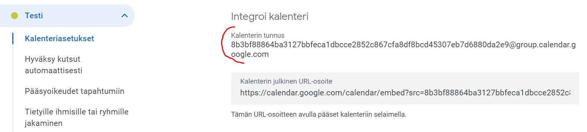
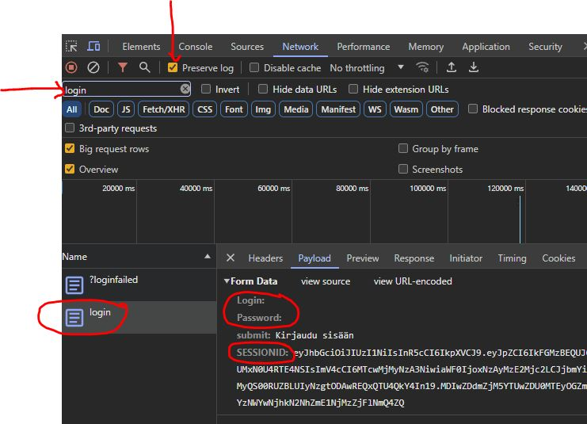
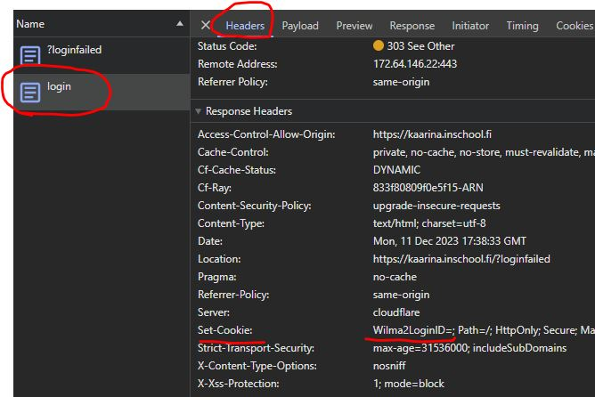

# Wilma kalenteriin

## Kuvaus

Wilma kalenteriin on python sovellus, joka hakee Wilmasta kotitehtävät ja lisää ne käyttäjän valitsemaan Google kalenteriin.

Sovelluksella pystyy poimimaan Wilmasta kokeet ja kotitehtävät ja lisäämään ne Google kalenteriin. Sovellus osaa myös lisätä tehtävät Habiticaan.

Päätoiminnallisuudet löytyvät **WilmaTask.py** tiedostosta.

### Tausta 

Halusin luoda sovelluksen, jolla voisin helposti lisätä Wilman kotitehtävät Google kalenteriin. Tämä helpottaa lasten kotitehtävien seuraamista.

## Asennus

Suosittelen luoda virtuaaliympäristön tätä sovellusta varten. Virtuaaliympäristön luominen onnistuu seuraavalla komennolla:

Asenna virtuaaliympäristö moduuli
```bash
pip install virtualenv
```

Navigoi projektin juureen ja luo virtuaaliympäristö komennolla

```bash
python3 -m venv .venv
```
tai 

```bash
python -m venv .venv
```

Aktivoi virtuaaliympäristö komennolla

Windows
```bash
.venv\Scripts\activate
```
Linux tai Mac tietokoneissa
```bash
source .venv/bin/activate
```
## Riippuvuudet

Asenna tarvittavat kirjastot komennolla
    
```bash
pip install -r requirements.txt
```

Asenna lisäksi Playwright selain ajuri komennolla. Lisätietoa Playwrightista löytyy [täältä](https://playwright.dev/python/docs/intro)

```bash
playwright install
```

Lisäksi tarvitset tätä sovellusta varten Google Calendar API:n. Tarkat ohjeet löytyvät Googlen omilta sivuilta [Python quickstart](https://developers.google.com/calendar/api/quickstart/python)

Tietokantana on osassa SQLite3. Lisätietoa SQLite3:sta löytyy [täältä](https://docs.python.org/3/library/sqlite3.html).

Tietokantana on osassa MongoDB. Lisätietoa miten luoda MongoDB tietokanta [täältä](https://www.mongodb.com/docs/atlas/getting-started/).

Voit testata tietokantayhteyttä ajamalla mongodbconnection.py tiedoston.


## Käyttö

Muuta tiedostossa env olevat muuttujat haluamiksesi ja nimeä tiedosto .env-tiedostoksi. Jos et käytä Habiticaa, älä muuta env-tiedoston Habitica-muuttujia.


Tarvitset Google kalenterin id:n. Lisätietoa Google kalenterin id:stä löytyy kun menet kalenterin asetuksiin ja kopioit "Kalenterin tunnus" kohdasta kalenterin id:n. 



Tarvitset myös Habitica API:n avaimet, jos haluat lisätä tehtävät Habiticaan tämän sovelluksen avulla. Lisätietoa Habitica API:n avaimista löytyy [täältä](https://habitica.fandom.com/wiki/Guidance_for_Comrades).

Habitica API:n dokumentaatio löytyy [täältä](https://habitica.com/apidoc/). Mikäli käytät Habitican API:a, muista lisätä täyttää lomakkeen, jossa kerrot mitä aiot tehdä Habitican API:lla. Lomake löytyy [täältä](https://habitica.fandom.com/wiki/Guidance_for_Comrades#Rules_for_Third-Party_Tools) > Notifying Staff About Your Tool

## BeautifulSoup

Tiedosto WilmaTask.py käyttää BeautifulSoup kirjastoa Wilman sivujen parsimiseen. Lisätietoa BeautifulSoupista löytyy [täältä](https://www.crummy.com/software/BeautifulSoup/bs4/doc/)

Sen käyttö saattaa vaatia Wilma sivuston tarkempaa tutkimista.

### Kehittäjätyökalut (Developer Tools)

Navigoi Wilma sivustolle ja avaa kehittäjätyökalut joko painamalla F12 tai oikealla hiiren näppäimellä ja valitse "Inspect". 

Navigoi kehittäjätyökaluissa "Network" välilehdelle. Täppää "Preserve log" ja yritä kirjautua (pelkkä "Kirjaudu sisään" ilman tunnuksia riittää).

Nyt kehittäjätyökaluissa pitäisi näkyä login POST pyyntö. Etsi login pyyntö. Headers välilehdeltä löytyy tarvitsemanne payload tiedot. Nämä ovat otsikomme.



Lisäksi tarvitsemme session cookien. Nämä löytyvät "Cookies" välilehdeltä tai samalta paikasta, josta löysimme payload tiedot "Headers" välilehdeltä. Tarkista Set-Cookie cookien nimi.




### Funktiot

| Funktion nimi             | Kuvaus                                           | Parametrit                                                                                               | Palauttaa                                   |
|---------------------------|--------------------------------------------------|----------------------------------------------------------------------------------------------------------|--------------------------------------------|
| `wilma_student`           | Kirjautuu Wilmaan ja hakee oppilaan.             | `login_req` (HTTP-vastaus), `session` (istunto), `wilma_student` (oppilaan nimi, oletusarvo)             | `session`, `oppilas_url`                   |
| `wilma_subject`           | Hakee oppilaan kouluaineet.                      | `session` (istunto), `oppilas_url` (oppilaan URL)                                                        | Tulostaa aineiden linkit                   |
| `wilma_homeworks`         | Hakee ja käsittelee kotitehtävät.                | `session` (istunto), `link_url` (aineen URL), `subject_text` (aineen teksti)                             | Tulostaa kotitehtävät                      |
| `wilma_exams`             | Hakee ja tallentaa kokeiden tiedot.              | `session` (istunto), `oppilas_url` (oppilaan URL)                                                        | Tulostaa kokeiden tiedot                   |
| `add_unique_item_mongodb` | Lisää dokumentin MongoDB-tietokantaan.           | `subject` (aihe), `description` (kuvaus), `start` (alkamisaika), `stop` (loppumisaika), `created` (luomisaika), `db` (tietokanta) | Tulostaa lisäysstatus                    |
| `wilma_signin`            | Kirjautuu Wilmaan.                               | -                                                                                                        | `login_req` (HTTP-vastaus), `session` (istunto) |
| `connect_mongodb`         | Yhdistää MongoDB-tietokantaan.                   | `collection` (MongoDB-kokoelma)                                                                          | Palauttaa MongoDB-kokoelman               |
| `find_items_mongodb`      | Hakee dokumentit MongoDB-kokoelmasta.            | `collection` (MongoDB-kokoelma), `query` (hakuehto, oletusarvo {})                                       | MongoDB-dokumenttien iteroitava kokoelma  |
| `refactor_events`         | Muotoilee MongoDB:n dokumentit Google Kalenteriin sopiviksi tapahtumiksi. | `events` (MongoDB:n dokumenttien lista)                                         | Google kalenteriin sopiva muotoiltujen tapahtumien lista             |
| `google_calendar_token`   | Hakee Google Calendar API:n tokenit.             | -                                                                                                        | Palauttaa Google API:n credentials        |
| `show_calendar_events`    | Näyttää tapahtumat Google Kalenterista.          | `calendarID` (kalenterin tunniste, oletusarvo "primary")                                                 | Tulostaa tulevat tapahtumat               |
| `create_calendar_event`   | Luo uuden tapahtuman Google Kalenteriin.         | `event` (kalenteritapahtuman tiedot), `calendarID` (kalenterin tunniste)                                 | Tulostaa luodun tapahtuman linkin         |
| `create_habitica_task`     | Lisää yhden tehtävän Habiticaan.                | `challenge_id` (Habitican haasteen tunnus), `task_data` (tehtävän tiedot)                           | Vastausobjekti tehtävän luomisen jälkeen  |
| `create_all_habitica_tasks`| Lisää useita tehtäviä Habiticaan.               | `challenge_id` (Habitican haasteen tunnus), `tasks` (tehtävien lista)                               | Lista vastausobjekteista ja niiden tiloista |
| `load_from_json`           | Lataa tehtäviä JSON-tiedostosta.                | `filename` (JSON-tiedoston polku)                                                                    | Lataa ja palauttaa tehtävät tiedostosta   |
| `refactor_to_habitica_tasks` | Muotoillaan tehtävä Habiticaan sopivaksi.    | `text` (tehtävän teksti), `notes` (tehtävän muistiinpanot) | Palauttaa muotoillun tehtävän Habiticaa varten |
| `delete_from_mongodb`      | Poistaa dokumentteja annetusta MongoDB-kokoelmasta. | `collection` (MongoDB-kokoelma), `query` (poistoehto, oletusarvo {}) | Tulostaa poistettujen dokumenttien määrän  |

